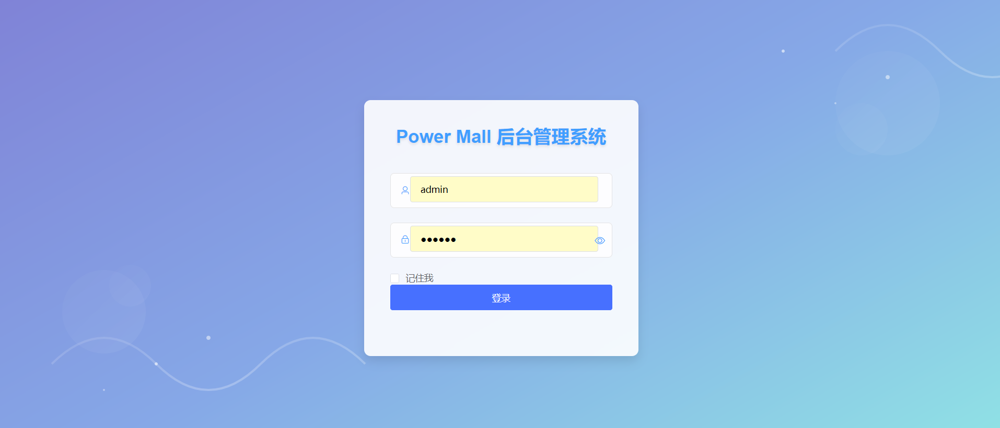
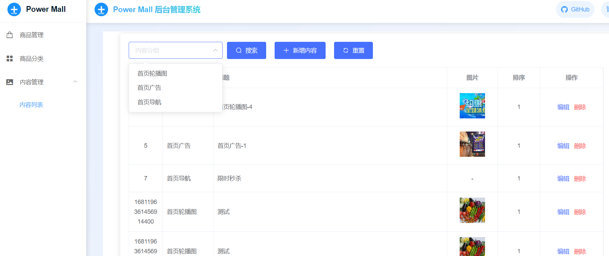
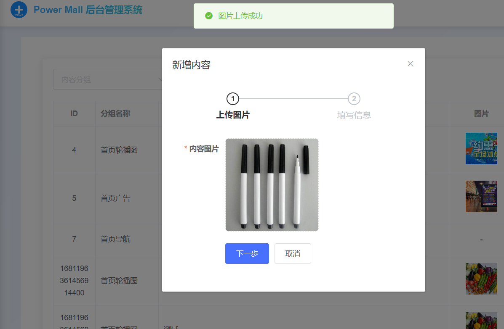
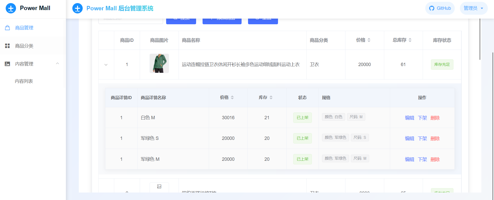

## power-mall项目后台管理系统的前端
### 主要包括：
- 商品管理
- 商品分类管理
- 内容管理
### 用到的技术
- axios: ^0.18.1
- core-js: ^3.30.0
- element-ui: ^2.15.13
- vue: 2.6.10 
- vue-router: ^3.6.5
- vuex: 3.1.0
##### 如果你想要学习这个项目，需要保证
node版本不能低于8.9、不能高于17
> 全局安装 n  npm install -g n 
> 
> 查看服务器上可用的版本 n ls-remote --all
> 
> 安装最新版node  n latest
> 
> 安装某个具体版本  n 16.18.0
> 
> 查看已经安装过的node版本  n ls
> 
> 删除14.13.1版本 n rm 14.13.1
##### 下面是项目一些截图

